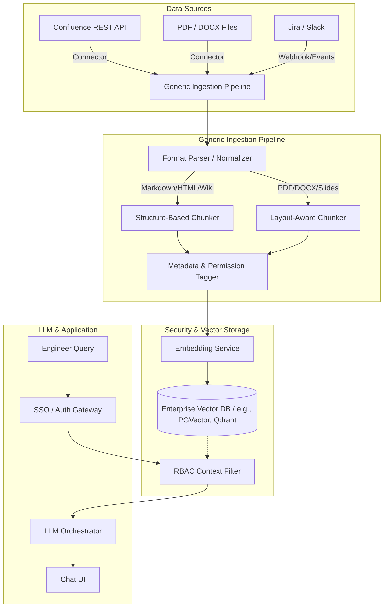

# Enterprise RAG Architecture

This document describes the high-level architecture and data schemas designed to scale **IncidentPilot** from a prototype to a secure, modular, enterprise-grade incident response assistant.

---

## 1. System Architecture

The core philosophy of this design is **strict modular decoupling**. The pipeline is split into four distinct layers: Connectors, Normalization, Security/Storage, and Retrieval/Orchestration.



### Component Description

1. **Connectors (`BaseConnector`)**: Responsible for connecting to external data repositories (Confluence spaces, cloud drives, file systems) and retrieving raw byte content or HTML.
2. **Normalization & Parsing (`BaseParser`)**: Standardizes diverse data formats (HTML, PDFs, DOCX, Markdown) into a unified internal format, stripping unnecessary metadata and extracting tables or structural outlines.
3. **Chunking & Tagging**: Splits normalized text into chunks using structure-aware or layout-preserving chunking, and stamps every chunk with the standard internal schema metadata (e.g., source file, modification dates, and ACLs).
   * **Structure-Based Chunking**: Applied to structured text documents (e.g., **Markdown files, HTML documents, Confluence Wiki pages**). Splits text at logical headers (`#`, `##`, `<h3>`) to preserve section context.
   * **Layout-Aware Chunking**: Applied to formats with visual layouts (e.g., **PDFs, DOCX files, spreadsheets, presentations**). Detects reading order, multi-column divisions, and preserves tables as discrete Markdown/HTML blocks.
4. **Security & Embedding**: Generates vector representations of chunks using an enterprise embedding API or model, then upserts the vectors and metadata fields into the persistent Vector Database.
5. **Retrieval & RBAC pre-filtering**: During a search query, uses the user's authenticated Active Directory/Identity identity to construct filter criteria, ensuring vector search matches are strictly restricted to documents the user has access to.

---

## 2. Standard Internal Schema

All documents passing through the normalization and parsing pipeline are transformed into this standard internal schema.

```json
{
  "$schema": "http://json-schema.org/draft-07/schema#",
  "title": "NormalizedDocumentChunk",
  "type": "object",
  "properties": {
    "chunk_id": {
      "type": "string",
      "description": "Unique deterministic hash generated from the document ID and section offset."
    },
    "document_id": {
      "type": "string",
      "description": "Unique identifier of the source document (e.g. Confluence Page ID, file path)."
    },
    "title": {
      "type": "string",
      "description": "Title of the parent document."
    },
    "section": {
      "type": "string",
      "description": "The specific heading or section title this chunk belongs to."
    },
    "content": {
      "type": "string",
      "description": "The parsed, clean text or markdown content of this chunk."
    },
    "source_type": {
      "type": "string",
      "enum": ["confluence", "jira", "slack", "pdf", "docx", "markdown", "other"],
      "description": "The origin source platform of the document."
    },
    "source_url": {
      "type": "string",
      "format": "uri",
      "description": "Direct clickable link to the source document."
    },
    "last_updated": {
      "type": "string",
      "format": "date-time",
      "description": "ISO 8601 timestamp of when the source document was last modified."
    },
    "permissions": {
      "type": "array",
      "items": {
        "type": "string"
      },
      "description": "List of user/group identifiers (e.g., Active Directory group IDs, LDAP roles) allowed to access this document."
    },
    "checksum": {
      "type": "string",
      "description": "SHA-256 hash of the content to allow quick change detection during incremental syncs."
    }
  },
  "required": ["chunk_id", "document_id", "title", "content", "source_type", "last_updated", "permissions", "checksum"]
}
```

---

## 3. Extension Plan

### Step 1: Base Interfaces
Define the python abstract base classes for `BaseConnector`, `BaseParser`, and `BaseVectorStore`.

### Step 2: Local Connectors
Build local implementations (`LocalFolderConnector` and `PDFParser`/`DOCXParser`) to test the processing, chunking, and metadata tagging pipeline.

### Step 3: Enterprise Cloud Connectors
Write external connectors using official client SDKs (e.g., Atlassian SDK for Confluence REST API) to fetch records and permissions dynamically.
