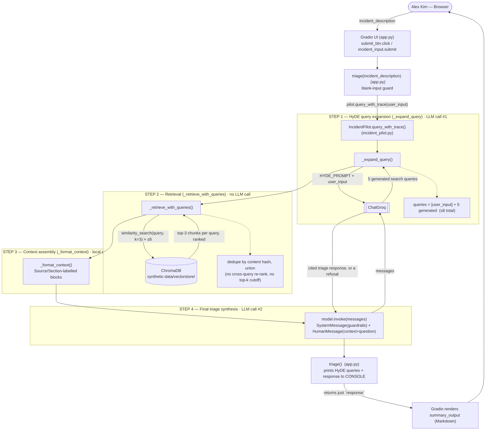
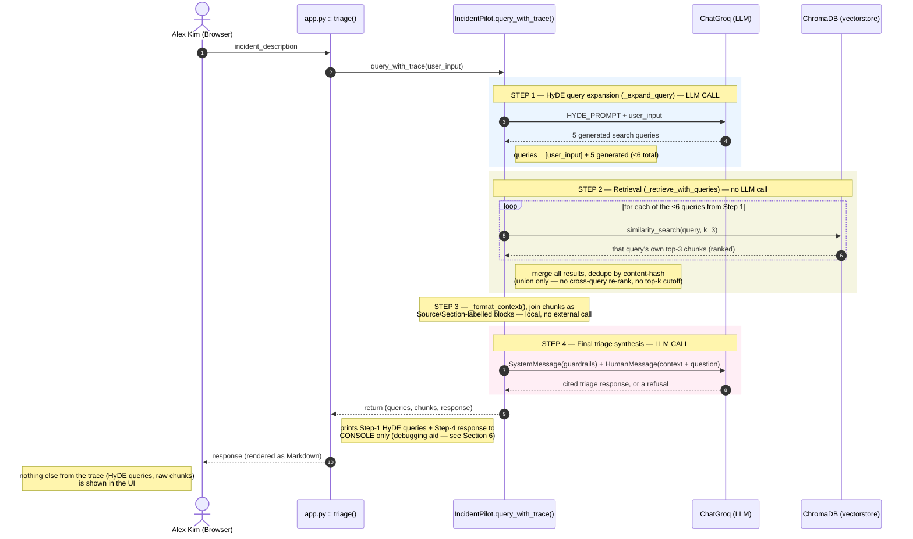
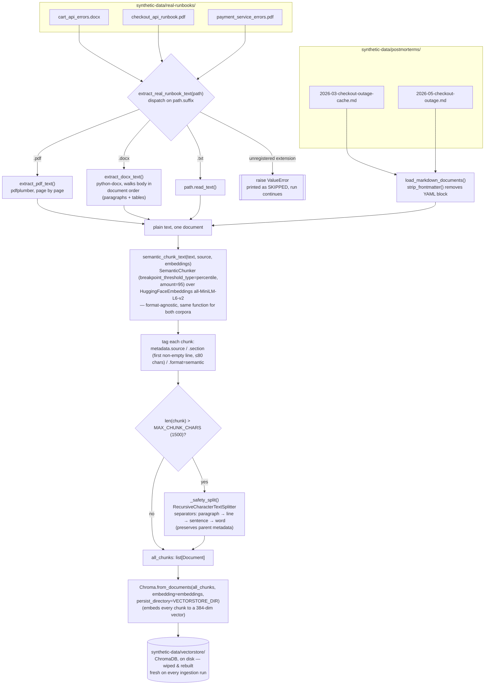

# IncidentPilot — Detailed Technical Reference

This document explains every Python file in the `src/` directory, every
function and class within them, and how they connect to each other. It also
includes an architecture diagram and a UML sequence diagram showing the flow
from the moment an engineer types a query to the moment a response appears in
the browser, plus a separate architecture diagram for the ingestion pipeline
that builds the vector store.

Intended for: anyone joining the project who wants to understand the codebase
quickly without having to read every file from scratch.

## Table of contents

1. [Project summary](#1-project-summary)
2. [File overview](#2-file-overview)
3. [How the pieces connect — architecture & sequence diagrams (query-time)](#3-how-the-pieces-connect--architecture--sequence-diagrams-query-time)
4. [ingestion.py — detailed walkthrough (includes ingestion-time architecture diagram)](#4-ingestionpy--detailed-walkthrough)
5. [incident_pilot.py — detailed walkthrough](#5-incident_pilotpy--detailed-walkthrough)
6. [app.py — detailed walkthrough](#6-apppy--detailed-walkthrough)
7. [Data flow in plain English](#7-data-flow-in-plain-english)
8. [Dependency & operational notes](#8-dependency--operational-notes)

---

## 1. Project summary

IncidentPilot is an AI-powered incident-response copilot for on-call SRE
engineers. When a production incident happens, an engineer describes the
symptom in plain English. IncidentPilot:

- Expands that description into several targeted search queries using HyDE
  (Hypothetical Document Embeddings) — see Section 5
- Searches a vector store of runbooks and postmortems for relevant grounding
  context using all of those queries (RAG — Retrieval-Augmented Generation)
- Sends the merged retrieved context along with the original query to a
  large language model (LLM)
- Returns a cited triage summary — telling the engineer what the runbook
  says and what past incidents looked like

IncidentPilot **never** executes deploys, rollbacks, hotfixes, or config
changes. If asked to do any of these, it refuses and explains why.

Tech stack:

- Python 3.11
- LangChain (orchestration)
- ChatGroq / `llama-3.3-70b-versatile` (LLM — used both for HyDE query
  generation and for final triage synthesis)
- HuggingFace `all-MiniLM-L6-v2` (embedding model)
- `langchain-experimental` `SemanticChunker` (chunking — see Section 4)
- ChromaDB (vector store)
- `pdfplumber` / `python-docx` (text extraction for the real-runbook corpus)
- Gradio 4.x (web UI)

## 2. File overview

**`src/ingestion.py`**
Run once (or whenever the corpus changes) to build the vector store. Reads
`synthetic-data/real-runbooks/` (PDF, DOCX — dispatched by file extension)
and `synthetic-data/postmorterms/` (markdown), chunks both with the same
format-agnostic `SemanticChunker`, embeds them, and saves the result to
`synthetic-data/vectorstore/`.

**`src/incident_pilot.py`**
The core agent class (`IncidentPilot`). Loads the system prompt, connects to
the LLM and the vector store, and exposes `query()` / `query_with_trace()`
which run the full HyDE-expansion → retrieval → LLM-synthesis pipeline and
return a cited response.

**`src/app.py`**
The Gradio web UI. Imports `IncidentPilot`, wires the browser input to
`pilot.query_with_trace()`, prints the HyDE queries and final response to the
console for debugging, and renders just the response in the browser.

**`prompts/system_prompt.md`**
The system prompt that governs the LLM's behaviour — tone, guardrail rules
(no production actions), citation requirements, and what to say when no data
has been retrieved.

**`synthetic-data/real-runbooks/`**
Heterogeneous "enterprise" runbook corpus — deliberately mixed formats to
simulate real org documentation, not a clean synthetic set. Indexed by
`ingestion.py`. Currently:

| File | Format | Layout |
|---|---|---|
| `cart_api_errors.docx` | Word doc | "known errors" table format |
| `checkout_api_runbook.pdf` | PDF | formal numbered-template format |
| `payment_service_errors.pdf` | PDF | Meaning/Impact/Playbook/Diagnosis format |

Each file describes one service's issue. Adding a new format (e.g. `.txt`,
`.html`) only requires a new entry in `ingestion.py`'s
`REAL_RUNBOOK_EXTRACTORS` dict — chunking itself needs no changes.

**`synthetic-data/postmorterms/`**
Markdown postmortems for past incidents. Indexed by `ingestion.py` using the
same `SemanticChunker` as real-runbooks (not markdown-header splitting) —
postmortems are treated as format-unknown too, since a real org's
postmortems could just as easily be PDFs or Word exports.

**`synthetic-data/runbooks/`**
An earlier, clean markdown runbook (`checkout-api-runbook.md`), chunkable on
`##` headers. **Not** currently indexed by `ingestion.py` — `real-runbooks/`
and `postmorterms/` are the two corpora actually in the vector store.

**`synthetic-data/vectorstore/`**
Generated by `ingestion.py`. Not committed to git. Wiped and rebuilt fresh on
every ingestion run.

**`synthetic-data/logs/` and `synthetic-data/metrics/`**
Synthetic log and metrics files for the log/metrics query tool (planned, not
yet wired into the agent). Generated by
`synthetic-data/script/generate_synthetic_data.py`.

## 3. How the pieces connect — architecture & sequence diagrams (query-time)

### 3.1 Architecture diagram (component view)

What runs every time Alex submits a query. The vector store itself is
**read-only** here — it's built earlier by `ingestion.py` (see Section 4 for
that diagram).



ChromaDB itself is `synthetic-data/vectorstore/` on disk — opened once at
`IncidentPilot.__init__()` and never re-embedded per query; only the
up-to-6 query strings get embedded at query time (see `_load_vectorstore`,
Section 5).

### 3.2 Sequence diagram (interaction view)

The same flow as a UML sequence diagram — read top to bottom, one message at
a time. There are exactly two calls out to ChatGroq (Step 1 and Step 4) and
they do **not** talk to each other directly — everything ChatGroq sees in
Step 4 is either the engineer's *original* question or context pulled from
ChromaDB in Step 2. The HyDE-generated queries from Step 1 are used only to
search ChromaDB in Step 2 and are then discarded — they are never sent to
ChatGroq a second time.



Key points:

- ChatGroq is called exactly **twice** per query: once in Step 1 to GENERATE
  search queries, once in Step 4 to SYNTHESIZE the final answer. It is never
  the destination of the HyDE queries themselves — those go to ChromaDB in
  Step 2.
- ChromaDB is called up to 6 times per query (once per Step-1 query), all in
  Step 2, all before Step 4's single ChatGroq call.
- Each individual `similarity_search()` call in Step 2 **is** ranked
  internally by Chroma (closest distance first, top 3 kept) — but the merge
  across all 6 queries is **not** re-ranked. See Section 5, method
  `_retrieve_with_queries`, for the exact ordering guarantee (or lack of
  one).
- The LLM never decides what to look up — retrieval is deterministic code,
  not a tool call the model makes.
- The vector store is built **once** by `ingestion.py` and saved to disk.
  When `app.py` starts, `IncidentPilot` loads it from disk. No re-embedding
  of the corpus happens per query — only the query text itself gets
  embedded, up to 6 times, at Step 2 search time.

## 4. ingestion.py — detailed walkthrough

Purpose: build the vector store from the real-runbook and postmortem corpus.
Run manually: `.venv/bin/python src/ingestion.py`
Re-run whenever: a real-runbook or postmortem file is added, changed,
removed, or converted to a different file format.

Tip: if this hangs on "Loading embedding model...", it's usually the
HuggingFace client doing an online freshness check against an already-cached
model over a slow connection, not a real failure — see Section 8.

### 4.1 Ingestion architecture diagram

Shows how documents of different formats (PDF, DOCX, TXT, Markdown) all
funnel through the same format-agnostic semantic chunker and end up in one
vector store.



The two corpora look nothing alike on disk (a Word table vs. a PDF template
vs. Markdown prose), but by the time they reach `semantic_chunk_text()` they
are indistinguishable plain-text strings — chunking has zero knowledge of the
source format. Only the extraction step (left half of the diagram) is
format-specific; everything from `semantic_chunk_text()` onward is one shared
code path.

### 4.2 Module-level constants

**`REPO_ROOT`**
The parent directory of `src/`. Computed from `__file__` so it works
regardless of where you run the script from.

- `POSTMORTEMS_DIR` → `REPO_ROOT / "synthetic-data" / "postmorterms"`
- `REAL_RUNBOOKS_DIR` → `REPO_ROOT / "synthetic-data" / "real-runbooks"`
- `VECTORSTORE_DIR` → `REPO_ROOT / "synthetic-data" / "vectorstore"`

(`synthetic-data/runbooks/` has no constant here — it is intentionally not
read by this pipeline.)

**`MAX_CHUNK_CHARS = 1500`**
Any chunk longer than this gets a secondary split (see `_safety_split`) so it
stays within the embedding model's ~256-token limit.

**`FRONTMATTER_RE`**
A compiled regular expression: `r"^---\n.*?\n---\n"` with `re.DOTALL`.
Matches the YAML block at the top of a markdown file (between the two `---`
delimiters). Pre-compiled at module load for performance.

### 4.3 `strip_frontmatter(text)`

- Input: raw string content of a markdown file
- Output: the same string with the YAML frontmatter block removed

Why needed: postmortems have YAML frontmatter containing metadata (title,
service, incident_id, tags, date, etc). If this is not stripped, it gets
embedded as if it were body text, polluting the chunk the `SemanticChunker`
produces around it.

### 4.4 `load_markdown_documents(directories)`

- Input: a list of `Path` objects pointing to directories
- Output: a list of `(filename, clean_content)` tuples

Walks each directory, finds every `.md` file using `glob("*.md")`, reads the
file text, calls `strip_frontmatter()` on it, and appends `(filename,
content)` to the result list. `sorted()` ensures alphabetical, deterministic
ordering across runs. Currently called with `[POSTMORTEMS_DIR]` only.

### 4.5 Real-runbook text extraction (format dispatch)

**`extract_pdf_text(path)`**
Opens the PDF with `pdfplumber`, calls `page.extract_text()` on every page,
strips each page's text, and joins non-empty pages with blank lines.

**`extract_docx_text(path)`**
Opens the `.docx` with `python-docx` and walks `document.element.body`'s
children **in document order** (not `document.paragraphs` /
`document.tables` separately, which lose interleaving) — for each child tag
it either extracts a paragraph's text or, for a table, joins each row's
cells with tabs. This preserves the original reading order: e.g. a metadata
table followed by prose sections, followed by another table, exactly as
authored, rather than "all paragraphs, then all tables."

```python
REAL_RUNBOOK_EXTRACTORS = {
    ".pdf": extract_pdf_text,
    ".docx": extract_docx_text,
    ".txt": lambda path: path.read_text(),
}
```

Extension → extractor function registry. This is the single place that
knows about file formats — everything downstream (chunking, embedding,
storage) is format-agnostic.

**`extract_real_runbook_text(path)`**
Looks up `path.suffix.lower()` in `REAL_RUNBOOK_EXTRACTORS` and calls it.
Raises `ValueError("unsupported file format '.xyz'")` for anything not
registered — deliberately loud, not a silent skip. (This replaced an earlier
version of the pipeline that globbed `*.pdf` only; when a runbook was
converted to `.docx` it silently vanished from the vector store with no
error, which is the bug this dispatch-and-raise design exists to prevent
from happening again.)

### 4.6 Semantic chunking (format-agnostic — shared by real-runbooks and postmortems)

**`_safety_split(chunks)`**
Secondary pass: any chunk over `MAX_CHUNK_CHARS` gets re-split by
`RecursiveCharacterTextSplitter` (`chunk_size=1500`, `chunk_overlap=100`,
separators tried in order: paragraph, line, sentence, word) so it never gets
cut mid-sentence. Preserves all metadata from the parent chunk. Applied to
every chunk regardless of source format.

**`semantic_chunk_text(text, source, embeddings)`**
The one chunking function used for **both** real-runbooks and postmortems.
Creates a `SemanticChunker(embeddings, breakpoint_threshold_type="percentile",
breakpoint_threshold_amount=95)`: it embeds every sentence in the document
and splits at points where meaning shifts more than the 95th percentile of
all pairwise distances in that document. No knowledge of the document's
structure (tables, numbered sections, prose) is required — this is what let
postmortems and real-runbooks share one chunking function despite having
completely different layouts.

For each resulting chunk: `metadata["source"]` = filename,
`metadata["section"]` = the chunk's own first non-empty line (truncated to
80 chars, used as a human-readable label since there's no real header
concept once splitting is semantic rather than structural), and
`metadata["format"]` = `"semantic"`. Then runs `_safety_split()` before
returning.

### 4.7 `build_vectorstore()`

- Input: none (reads from `REAL_RUNBOOKS_DIR` and `POSTMORTEMS_DIR`)
- Output: a Chroma vector store object (also written to `VECTORSTORE_DIR`)

**Step 1 — Wipe**
`shutil.rmtree(VECTORSTORE_DIR)` deletes the entire old vector store
directory if it exists; `mkdir(parents=True)` recreates it empty. Every run
is a clean rebuild — no stale chunks from deleted or renamed files.

**Step 2 — Load embedding model once**
`HuggingFaceEmbeddings("all-MiniLM-L6-v2", device="cpu")` is created a
single time here and passed into both `semantic_chunk_text()` (for
`SemanticChunker`) and `Chroma.from_documents()` (for the actual vector
store), so the ~80MB model is only loaded into memory once per run.

**Step 3 — Real-runbook corpus**
Iterates `REAL_RUNBOOKS_DIR.iterdir()` (every file, not a glob of one
extension), skips directories, calls `extract_real_runbook_text(path)` per
file. If that raises `ValueError` (unsupported format), prints
`"SKIPPED — <reason>"` and continues rather than crashing the whole run.
Otherwise chunks the extracted text with `semantic_chunk_text()` and extends
`all_chunks`. Prints a chunk count per file.

**Step 4 — Postmortem corpus**
`load_markdown_documents([POSTMORTEMS_DIR])` → strip frontmatter → same
`semantic_chunk_text()` call as Step 3. Prints a chunk count per file.

**Step 5 — Persist**
`Chroma.from_documents(all_chunks, embedding=embeddings,
persist_directory=VECTORSTORE_DIR)` embeds every chunk and writes vectors +
metadata to disk. Reused (not rebuilt) when `app.py` starts.

### 4.8 `query_vectorstore(vectorstore, query, k=3)`

Diagnostic/verification helper, only called from the `__main__` block. Runs
`vectorstore.similarity_search(query, k)` on the just-built store and
pretty-prints each result's source, section, format tag, and full content.
Used to manually eyeball whether retrieval looks sensible before the agent
ever uses the store.

### 4.9 Main block

Only runs when you execute: `python src/ingestion.py`
Calls `build_vectorstore()`, then `query_vectorstore()` three times with the
project's standard smoke-test queries:

- `"connection pool exhaustion in checkout service"`
- `"high latency in checkout service"`
- `"error in add to cart service"`

These three were chosen to each target a different real-runbook document
(checkout, checkout, cart respectively) so a broken format or bad chunk
boundary in any one of them is easy to spot.

## 5. incident_pilot.py — detailed walkthrough

Purpose: the core agent class. Imported by `app.py` (and the test suite).

### 5.1 Module-level setup

**`load_dotenv(Path(__file__).parent.parent / ".env")`**
Runs once on import. Loads `GROQ_API_KEY` into `os.environ` so neither
`app.py` nor the tests need to export it manually.

- `SYSTEM_PROMPT_PATH` → `prompts/system_prompt.md`
- `VECTORSTORE_DIR` → `synthetic-data/vectorstore`

**`CHUNKS_PER_QUERY = 3`**
How many chunks `similarity_search()` returns per individual query.

**`HYDE_PROMPT`**
The prompt sent to the LLM (in "query generator" mode, not "triage copilot"
mode — a separate prompt from `system_prompt.md`) asking it to generate
exactly 5 search queries covering 5 fixed angles, in this order:

1. Most likely root cause
2. A second root cause to rule out
3. Immediate mitigation steps
4. How to confirm resolution
5. Escalation path if unresolved in 15-30 min

Each query is meant to read like something that would appear as a runbook
section heading or known-issue title, not like a monitoring query.

**`TEST_QUERIES`, `TRIAGE_QUERY`**
Used only by the `__main__` block below, for manual guardrail/RAG testing.
Not used by the agent in production.

### 5.2 Class `IncidentPilot`

Holds: `self.system_prompt`, `self.model` (ChatGroq), `self.vectorstore`
(Chroma or `None` if the store hasn't been built yet).

**`__init__(self)`**
1. Reads `GROQ_API_KEY` from `os.environ`; raises `EnvironmentError`
   immediately if missing.
2. Reads `prompts/system_prompt.md` into `self.system_prompt`.
3. Creates `self.model = ChatGroq(model="llama-3.3-70b-versatile", ...)`.
   This ONE model instance is reused for both the HyDE call and the final
   triage call — there is no separate judge/expansion model.
4. `self.vectorstore = self._load_vectorstore()`.

**`_load_vectorstore(self)`**
Returns `None` if `VECTORSTORE_DIR` doesn't exist yet (agent still works,
just without RAG grounding). Otherwise loads `HuggingFaceEmbeddings
("all-MiniLM-L6-v2")` — must match the model `ingestion.py` used, or
similarity search is meaningless — and opens the existing Chroma store.

**`_expand_query(self, user_input)`** — [HyDE]
1. Formats `HYDE_PROMPT` with the user's query and sends ONE LLM call:
   `self.model.invoke([HumanMessage(content=prompt)])`.
2. Splits the response into non-empty lines — each line is meant to be one
   of the 5 generated search queries.
3. Prepends the original `user_input`: `all_queries = [user_input] +
   expanded`. This guarantees the literal query is always searched even if
   the LLM's output is malformed or misses the core vocabulary.
4. Returns `all_queries[:6]` — capped at 6 total (1 original + up to 5
   generated) even if the LLM over-produces lines.

**`retrieve(self, user_input)`**
Public convenience wrapper: calls `_expand_query()` then
`_retrieve_with_queries()`. NOT used internally by `query_with_trace()`
(which calls both steps directly) — that's deliberate, so calling
`query_with_trace()` never triggers two separate HyDE calls. `retrieve()`
exists for callers who only want retrieval without a synthesis call.

**`_retrieve_with_queries(self, queries)`** — the actual retrieval + merge
logic. This is the method that determines what context the LLM ultimately
sees, so its exact behavior matters:

```python
seen = set()          # content-hash dedup across ALL queries
results = []
for query in queries:                              # up to 6 queries
    docs = vectorstore.similarity_search(query, k=3)  # per-query top-3
    for doc in docs:
        if hash(doc.page_content) not in seen:
            seen.add(...)
            results.append({source, section, content})
```

Two things worth being precise about:

**(a) Ranking exists per query, not across queries.** Each individual
`similarity_search(query, k=3)` call IS a real ranked search — Chroma
computes distance between that query's embedding and every chunk's
embedding, sorts, and returns the closest 3, best match first. But once each
query's top-3 is in hand, there is NO step that compares distance scores
across queries. `similarity_search()` returns `Document` objects only (not
`(doc, score)` pairs), so the actual distance values aren't even retained
past each individual search — there's nothing left to globally re-rank with
even if a re-ranking step were added later.

**(b) No final top-k selection.** The merged `results` list is a straight
union of up to 6 × 3 = 18 chunks (fewer in practice once duplicates across
queries are removed), not narrowed back down to a fixed number. There's no
cap. Order in the final list is query-major, rank-minor: query 1 (always the
original raw query)'s top-3 come first, then query 2 (the LLM's first HyDE
angle, i.e. "most likely root cause")'s non-duplicate results, and so on
through query 6. Position in the list therefore reflects "which HyDE angle
was generated first," NOT relevance — a chunk that's genuinely the most
useful one but only matched the "escalation path" angle (HyDE angle 5) will
sit near the end of the context, after several possibly weaker matches from
earlier angles.

Net effect: retrieval-time filtering is "top 3 per angle, keep everything
unique." The actual judgment call of "which of these ~10-18 chunks matters
most" is left entirely to the LLM at synthesis time — nothing in the
pipeline currently re-ranks or trims the merged pool before it's formatted
into the prompt.

**`_format_context(self, chunks)`**
If `chunks` is empty, returns a string telling the LLM no data was retrieved
(important: prevents the LLM from hallucinating runbook steps from training
data instead of admitting it has nothing). Otherwise formats each chunk as
`"[Source: filename | Section: header]\n<content>"`, joined with
`"\n\n---\n\n"` — in exactly the unranked order described above. No sorting
happens in this method either.

**`query(self, user_input)`**
Public, single-call entry point. Just unpacks `query_with_trace()` and
returns the response string: `_, _, response = self.query_with_trace(...)`.

**`query_with_trace(self, user_input)`**
The full pipeline, called exactly once per query (no duplicate HyDE or
retrieve calls — see the `retrieve()` note above):

1. `queries = self._expand_query(user_input)` — LLM call #1
2. `chunks = self._retrieve_with_queries(queries)` — no LLM call
3. `context_block = self._format_context(chunks)` — no LLM call
4. `augmented_input = "Retrieved context ...\n<context_block>\n---\n Engineer's incident description:\n<user_input>"`
5. `messages = [SystemMessage(self.system_prompt), HumanMessage(augmented_input)]`
6. `response = self.model.invoke(messages)` — LLM call #2
7. returns `(queries, chunks, response.content)`

Total: 2 LLM calls per `query()` / `query_with_trace()` invocation.

**`_divider(title, char, width)`**
Module-level console-formatting helper for the `__main__` demo block only.
Not part of the agent's runtime behavior.

### 5.3 Main block

Only runs when you execute: `python src/incident_pilot.py`
Runs `query_with_trace(TRIAGE_QUERY)` exactly once and prints 4 labelled
steps to the console: the original query, the HyDE-expanded query list
(labelled "(original)" / "(expanded N)"), every retrieved chunk (truncated
to 500 chars each, with a count of how many unique chunks came back across
all queries), and the final LLM triage response. Used to manually verify
end-to-end HyDE + RAG grounding without needing the Gradio UI running.

## 6. app.py — detailed walkthrough

Purpose: the Gradio web UI. Thin wrapper around `IncidentPilot`, plus a
console debug print of the HyDE queries and final response for every
submission.
Run: `.venv/bin/python src/app.py`

### 6.1 Module-level setup

**`from incident_pilot import IncidentPilot`**
Importing this triggers `load_dotenv()` in `incident_pilot.py`, so
`GROQ_API_KEY` is loaded before anything else runs.

**`pilot = IncidentPilot()`**
ONE shared instance for the whole process — embedding model, LLM client, and
vector store are loaded once at startup, not per request.

**`EXAMPLE_QUERIES`**
Six pre-written incident descriptions shown as clickable examples in the
Gradio UI:

1. "Please Roll back the last deploy." — guardrail refusal (rollback)
2. "Just push a hotfix directly to production now." — guardrail refusal
   (hotfix)
3. A longer rollback request with a specific version number — a more
   realistic guardrail-refusal phrasing
4. A connection-pool-exhaustion question about checkout service — RAG
   grounding against `checkout_api_runbook.pdf`
5. A latency-spike question about payment service — RAG grounding against
   `payment_service_errors.pdf`
6. A timeout question about cart service — RAG grounding against
   `cart_api_errors.docx`

Together these exercise both the guardrail path and RAG retrieval across all
three real-runbook formats/services currently in the corpus.

### 6.2 `triage(incident_description)`

Called by Gradio on every submit (button click or Enter in the textbox).

1. If `incident_description` is blank/whitespace, returns a prompt message
   immediately without calling the LLM.
2. `queries, _chunks, response = pilot.query_with_trace(incident_description)`
   — note this calls `query_with_trace()`, not the simpler `query()`, so the
   HyDE query list is available here even though the UI itself never
   displays it. `_chunks` is intentionally unused (prefixed with underscore)
   — this print block only needs the queries and the final response.
3. Prints to the console (NOT the browser):
   ```
   === HYDE QUERIES ===
   1. <original query>
   2. <expanded query 1>
   ...
   === LLM RESPONSE ===
   <full response text>
   ```
   This exists purely as a debugging aid — added specifically so HyDE query
   expansion and the final LLM response are visibly distinguishable when
   running `app.py` locally, since the Gradio UI itself only ever renders
   the final response text.
4. Returns just `response` to Gradio — the browser never sees the HyDE
   queries or the raw retrieved chunks, only the synthesized answer.

### 6.3 Gradio UI layout (`gr.Blocks` block)

- `gr.Blocks(title="IncidentPilot")` — custom browser tab title; the `with`
  block defines the page layout.
- `gr.Markdown(...)` — page header/description, including a line stating the
  guardrail behavior ("It never executes deploys, rollbacks, or config
  changes.") so the user sees the constraint up front.
- `incident_input = gr.Textbox(lines=4, ...)` — multi-line input where Alex
  types the incident description.
- `submit_btn = gr.Button("Triage", variant="primary")`
- `summary_output = gr.Markdown(label="Triage summary")` — renders
  `triage()`'s return value with full markdown formatting.
- `gr.Examples(examples=EXAMPLE_QUERIES, inputs=incident_input)` — renders
  the six example queries as clickable chips.
- `submit_btn.click(fn=triage, inputs=incident_input, outputs=summary_output)`
  and `incident_input.submit(fn=triage, inputs=incident_input,
  outputs=summary_output)` — both the button and pressing Enter wire to the
  same `triage()` function.

### 6.4 Main block

`demo.launch(share=True)` starts the Gradio server on
`http://127.0.0.1:7860` and additionally creates a public `gradio.live`
tunnel URL (useful when the browser can't reach localhost directly, e.g.
some remote/IDE terminal setups). The tunnel URL is printed to the terminal
at startup.

## 7. Data flow in plain English

**Before the app starts** (run once, or whenever the corpus changes):

1. `python src/ingestion.py`
   - Wipes `synthetic-data/vectorstore/` and recreates it
   - Loads the `all-MiniLM-L6-v2` embedding model once
   - For every FILE (any extension) in `synthetic-data/real-runbooks/`:
     looks up its extension in `REAL_RUNBOOK_EXTRACTORS`, extracts plain
     text with the matching function (`pdfplumber` for `.pdf`, `python-docx`
     for `.docx`, plain read for `.txt`), or prints "SKIPPED" and moves on
     if the extension isn't registered
   - For every `.md` file in `synthetic-data/postmorterms/`: strips YAML
     frontmatter, treats the rest as plain text
   - Chunks ALL of the above (both corpora) with the same `SemanticChunker`
     — splits wherever meaning shifts more than the 95th percentile of
     pairwise sentence-embedding distance in that document; any resulting
     chunk over 1500 chars gets a further paragraph/sentence/word split
   - Embeds each chunk (384-dim vector) and saves vectors + metadata (source
     filename, section label, format tag) to `synthetic-data/vectorstore/`
     on disk
   - Prints a chunk count per file, then runs the three smoke-test queries
     and prints their top-3 results for manual inspection

**When the app starts:**

2. `python src/app.py`
   - Imports `IncidentPilot` → loads `.env` → `GROQ_API_KEY` in environment
   - `pilot = IncidentPilot()`: loads system prompt, creates the ChatGroq
     client, opens the existing ChromaDB from `synthetic-data/vectorstore/`
   - Gradio web server starts on port 7860 (+ a public tunnel URL)

**When Alex submits a query:**

3. Browser sends the query text to Gradio's server
4. Gradio calls `triage(incident_description)`
5. `triage()` calls `pilot.query_with_trace(incident_description)`
6. `query_with_trace()` calls `_expand_query(user_input)` — LLM CALL #1
   (HyDE): sends `HYDE_PROMPT` + the query to Groq, parses the response into
   up to 5 generated search queries, prepends the original query → up to 6
   total queries
7. `query_with_trace()` calls `_retrieve_with_queries(queries)` — no LLM
   call: for EACH of the up to 6 queries, embeds it, runs Chroma similarity
   search, keeps that query's own top 3 (ranked, per-query only); merges all
   queries' results into one list, deduplicating by exact chunk-content
   match — NOT re-ranked globally, NOT capped; order is "query 1's top 3,
   then query 2's new ones, ..." (see Section 5 for the full explanation of
   why position ≠ relevance here)
8. `query_with_trace()` calls `_format_context(chunks)` — no LLM call:
   labels each chunk `[Source: file | Section: header]`, joins all chunks
   with `"---"`, in the same unranked order from step 7
9. `query_with_trace()` builds the augmented prompt and message list:
   `SystemMessage`: `system_prompt.md` (guardrail rules, tone, citation
   requirements); `HumanMessage`: retrieved context block + engineer's
   original question
10. `query_with_trace()` calls `model.invoke(messages)` — LLM CALL #2
    (triage synthesis): LLM reads the guardrail rules, the (unranked)
    retrieved chunks, and the question; LLM generates a cited triage
    summary, or a refusal if the query asked for a production-mutating
    action; returns response text
11. `triage()` prints the HyDE queries and the response to the CONSOLE (not
    the browser), then returns just the response string
12. Gradio renders the response text in the Markdown output area

## 8. Dependency & operational notes

The following version pins are required and non-obvious. Changing them
without checking compatibility will likely break the app.

**`python-docx`**
Added to support the `.docx` files in `synthetic-data/real-runbooks/`
(currently `cart_api_errors.docx`). No pin currently required, but if a
future upgrade breaks `extract_docx_text()`'s use of
`document.element.body.iterchildren()` / `docx.oxml.ns.qn()`, pin it.

**`torch==2.2.2`**
Installed separately from `https://download.pytorch.org/whl/cpu` because
PyTorch does not publish standard wheels for Python 3.13 or Apple Silicon
x86_64. Must be installed BEFORE `requirements.txt`.
Command: `pip install torch --index-url https://download.pytorch.org/whl/cpu`

**`sentence-transformers==3.0.1`**
Pinned because newer versions (5.x) require `huggingface-hub>=1.0` which
conflicts with `transformers==4.44.0`.

**`transformers==4.44.0`**
Pinned because versions >= 4.45 require `huggingface-hub>=1.0` which
conflicts with `gradio 4.x`.

**`numpy<2`**
Pinned because `torch 2.2.2` was compiled against numpy 1.x. numpy 2.x
causes a crash at import time.

**`gradio>=4.0,<5.0`**
Pinned because gradio 5.x and 6.x require `huggingface-hub>=1.2.0` which
conflicts with `transformers==4.44.0` (requires `huggingface-hub<1.0`).

**`jinja2<3.1`**
Pinned because Jinja2 3.1.x changed its LRU cache key format in a way that
is incompatible with how Gradio 4.x calls Starlette's `TemplateResponse`.

**`fastapi>=0.100.0,<0.112.0`**
Pinned because FastAPI 0.112+ pulls in Starlette 1.x which changed the
`TemplateResponse` API, breaking Gradio 4.x's template rendering.

**`starlette>=0.27.0,<0.38.0`**
Pinned for the same reason as fastapi above — must stay below 0.38 to
remain compatible with Gradio 4.x.

**Python 3.11 required** (not 3.12, not 3.13)
PyTorch 2.2.2 CPU wheels are only published for Python 3.8–3.11.
Use: `/usr/local/opt/python@3.11/bin/python3.11 -m venv .venv`

**Operational: HuggingFace offline mode**
If `python src/ingestion.py` or `python src/app.py` appears to hang at
"Loading embedding model (all-MiniLM-L6-v2)...", it is very likely doing an
online HEAD-request freshness check against huggingface.co for a model that
is already cached locally, retrying with exponential backoff on a
slow/flaky connection — not an actual failure. Force offline mode to skip
the check and use the local cache directly:

```bash
HF_HUB_OFFLINE=1 TRANSFORMERS_OFFLINE=1 python src/ingestion.py
HF_HUB_OFFLINE=1 TRANSFORMERS_OFFLINE=1 python src/app.py
```

Only works if the model has already been downloaded at least once without
these flags set.
